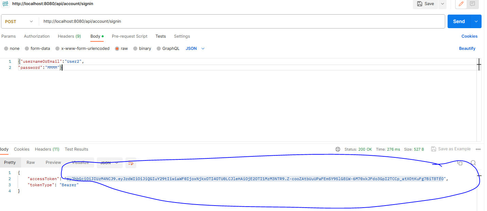

# Online bookstore - Spring boot Restful APIs
**/api/account** -> The endpoints are for signin/signup for a customer or an admin user (Roles: ROLE_CUSTOMER, ROLE_ADMIN).
The json for signup is :
{
    "username":"cu1",
    "email":"cu1@u.com",
    "password":"MMMM",
    "roleNames":["ROLE_CUSTOMER"]
}


The json for signin is:
{"usernameOrEmail":"User2",
"password":"MMMM"}
Token is returned back to the user as:


Any user can have multiple roles

**/api/book** -> The endpoints are for ADMIN user to create/delete/update book. These are secured by spring security. Bearer token received after successful login has to be sent as Authorization bearer while invoking these endpoints.

**/api/cart** -> The endpoints are for adding book/removing from a cart and checkout/payment for the cart.
These are secured by spring security. Bearer token received after successful login has to be sent as Authorization bearer while invoking these endpoints.


#### Environment

JDK 17
 
Docker

Intellij

####Steps to run in dev mode 

```bash
mvn install -DskipTests
docker-compose -f docker-compose-dev.yml up
```
####Implemented features:

```
1. Semver: There are three profiles as MAjor, Minor and Fix,
Example: To do Minor verisoing for dev environment  we trigger:
 spring-boot:run -DMinor -Dspring.profiles.active=dev. This will increment the minor version, resetting patch/fix version to zero.
 
 2. Dockerise: There are dcker compose ymls for deva nd test env. Above are the steps to run in any mode.
 
 3. Spring Security: It is used to check authorisation of the user.
 
 4. Deletion of a book: I have implemented soft deletion of a book by setting in_stock column of book table to false, 
 so that books linked to a cart are not affected (foreign key violation if I try to delete a book from database)
 
 5. I have used flyway for database migration so I have disabled hibernate enabled ddl update via relevant property in properties file.
 
 #### Missed parts:
Unit testing of controllers, service and repositories. This was a full blown project so to me it is a timeconsuming one unless one spends time
on a daily basis on the coding side. Due to school holidays I was away with family (inclusing family from home country) so I
couldnt spend much time on it. Otherwise this kind of work is what I ahve been doing in my previous role.
If time permitted, I would have implemnted all tests.
Also unfortunately at the last moment my tests stopped running due to jdk versioing issues so I cpuldnt run even a single test.
As I was running short of time and this seemed to be ongoing so I stopped. I shall be more than happy to answer all relevant questions in interview if ths solution passes.
